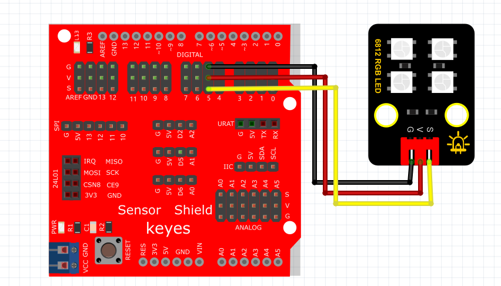

# Arduino

### 1. Arduino编程软件介绍

**Arduino**是一款开源电子原型平台，结合了硬件和软件，使得创建互动电子项目变得简单快捷。Arduino IDE提供了一个友好的编程环境，支持C/C++语言，并且包含大量的库，用户可以方便地控制各种组件如传感器、LED灯、马达等。

Arduino的应用范围广泛，从简单的家庭自动化项目到复杂的机器人控制系统都能实现。对于初学者而言，Arduino的简单性和丰富的社区资源十分有助于学习电子技术和编程。

---

### 2. 连接图

**连接图：**



### 3. 测试代码

#### 3.1 加载库的方式

在使用NeoPixel时，您需要确保在Arduino IDE中安装了Adafruit NeoPixel库。可以通过以下步骤安装库：

1. 打开Arduino IDE。
2. 点击“工具”菜单。
3. 选择“管理库…”。
4. 在搜索框中输入“Adafruit NeoPixel”。
5. 找到库后，点击“安装”按钮。

#### 3.2 代码示例

以下是用于控制NeoPixel灯带的Arduino代码示例：

```cpp
#include <Wire.h>
#include <Adafruit_NeoPixel.h>

Adafruit_NeoPixel rgb_display(5); // 定义一个像素的类，参数为灯珠数量

void setup() {
    rgb_display.begin(); // 启动6812RGB
    rgb_display.setPin(5); // 设置6812管脚接数字口5
    rgb_display.setBrightness(100); // 设置亮度为100，范围为0~255
}

void loop() {
    rgb_display.setPixelColor(0, 255, 0, 0); // 第一颗灯珠亮红色
    rgb_display.setPixelColor(1, 0, 255, 0); // 第二颗灯珠亮绿色
    rgb_display.setPixelColor(2, 0, 0, 255); // 第三颗灯珠亮蓝色
    rgb_display.setPixelColor(3, 255, 255, 255); // 第四颗灯珠亮白色
    rgb_display.show(); // 显示灯珠颜色
}
```

### 4. 测试结果

按照接线图接线并上传代码后，上电运行模块，4个LED将陆续显示不同的颜色：

1. **第一颗LED**亮红色。
2. **第二颗LED**亮绿色。
3. **第三颗LED**亮蓝色。
4. **第四颗LED**亮白色。

这段代码通过对每个灯珠设置不同的RGB值实现了颜色的切换，展示了Arduino与NeoPixel灯带的配合使用，便于演示光的变化，也为后续更复杂的灯光效果奠定了基础。

