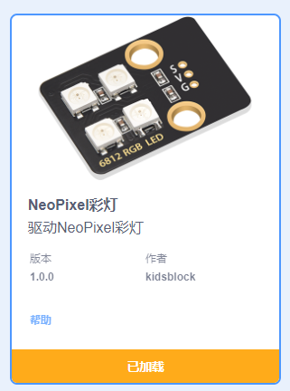
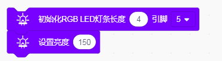
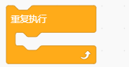
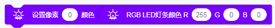
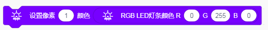
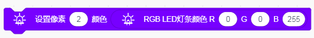
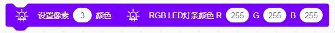
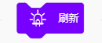
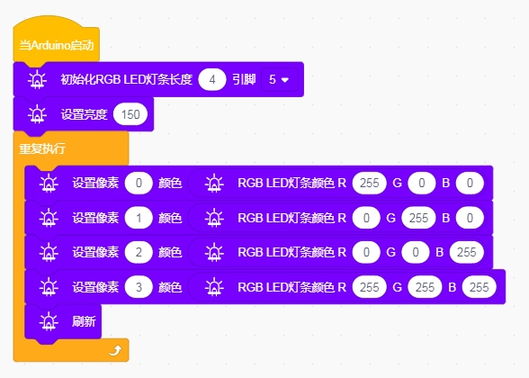

# Kidsblock

### 1. Kidsblock编程软件介绍

**Kidsblock**是一款面向初学者的图形化编程软件，旨在通过简洁的可视化模块帮助用户学习编程。它允许用户通过拖拽和配置不同的模块，快速构建控制电子设备的逻辑，如LED灯、传感器等。Kidsblock特别适合教育用途，使学生能够在轻松愉快的环境中掌握编程基础。

Kidsblock支持多种硬件平台，包括Arduino等，用户可以通过图形化界面实现复杂的逻辑运算，而无需编写传统代码，极大地降低了学习门槛。

---

### 2. 原理图

**原理图：**

### 3. 连接图

**连接图：**

### 4. 测试代码

以下是通过Kidsblock创建NeoPixel彩灯控制程序的步骤和配置信息：

#### 4.1 添加NeoPixel扩展

1. 先在Kidsblock编程界面下点击“添加扩展”。
2. 找到“NeoPixel彩灯模块”，然后点击添加。

#### 4.2 拖出模块

3. 添加完成后，在事件栏下拖出“Arduino开启”模块。

4. 在RGB LED灯条库下拖出“初始化灯条”模块，设置长度为4，引脚为5。

5. 拖出“设置亮度”模块，设置亮度为150。

6. 在控制栏拖出“重复执行”模块。

7. 在RGB LED灯条库下拖出“设置像素”模块，并设置像素0的颜色，R为255，其他为0。

8. 在RGB LED灯条库下拖出“设置像素”模块，并设置像素1的颜色，G为255，其他为0。

9. 在RGB LED灯条库下拖出“设置像素”模块，并设置像素2的颜色，B为255，其他为0。

10. 在RGB LED灯条库下拖出“设置像素”模块，并设置像素3的颜色，RGB都为255。

11. 在RGB LED灯条库下拖出“刷新”模块。

### 5. 生成的代码

通过上述步骤，生成的Kidsblock代码如下所示：

### 6. 测试结果

按照接线图接线并上传代码后，上电运行模块，4个LED将陆续显示不同的颜色：

1. **第一颗LED**亮红色。
2. **第二颗LED**亮绿色。
3. **第三颗LED**亮蓝色。
4. **第四颗LED**亮白色。

这个项目通过Kidsblock平台的图形化编程方式，实现了对NeoPixel灯条的简单控制，展示了Kidsblock在创意电子项目中的实用性和灵活性，帮助学习者在实践中掌握编程和电子控制的基本知识。

