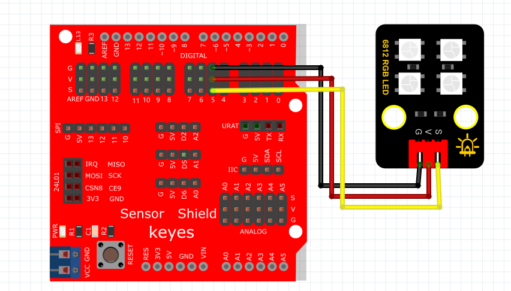
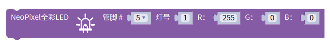
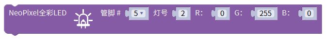
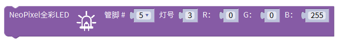
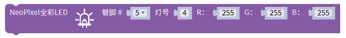
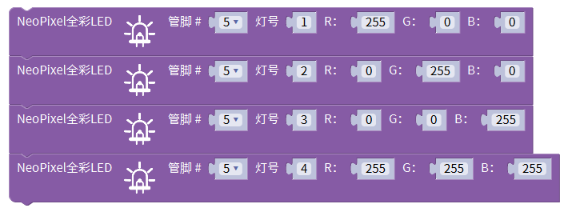

# Mixly

### 1. Mixly 编程软件介绍

**Mixly** 是一款图形化编程软件，旨在帮助初学者和学生通过直观的可视化界面快速学习编程。用户可以通过拖拽各类模块来构建控制电子设备的逻辑，如 LED 灯、传感器等。Mixly 特别适合教育用途，使学生能够在无代码的情况下轻松实现项目，提高了学习编程的乐趣和效率。

Mixly 支持多种硬件平台，包括 Arduino，让用户能够通过直观的拖拽方式创建复杂的逻辑，帮助他们理解编程的基础。

---

### 2. 连接图

**连接图：**

### 3. 测试代码

以下是通过 Mixly 创建全彩 LED 控制程序的步骤和配置信息：

#### 3.1 导入库文件

1. 在 Mixly 的编译器状态栏上点击“导入库”，找到文库文件，打开文件并选择`Keyes_sensor.xml`，点击打开。

#### 3.2 拖出控制模块

2. 在 `Keyes_sensor` 库里找到“显示模块”栏，然后拖入“控制全彩 LED”代码块，设置参数：
   - 管脚为 5
   - 灯号输入 1
   - R 为 255，其他的为 0

3. 再次在 `Keyes_sensor` 库里拖入“控制全彩 LED”代码块，设置参数：
   - 管脚为 5
   - 灯号输入 2
   - G 为 255，其他的为 0

4. 在 `Keyes_sensor` 库里拖入“控制全彩 LED”代码块，设置参数：
   - 管脚为 5
   - 灯号输入 3
   - B 为 255，其他的为 0

5. 最后，在 `Keyes_sensor` 库里拖入“控制全彩 LED”代码块，设置参数：
   - 管脚为 5
   - 灯号输入 4
   - RGB 都为 255

### 4. 生成的代码

通过上述步骤，生成的 Mixly 代码如下所示：

### 5. 测试结果

按照接线图进行连接并上传代码后，上电运行模块，4个 LED 将陆续显示不同的颜色：

1. **第一颗 LED** 亮红色。
2. **第二颗 LED** 亮绿色。
3. **第三颗 LED** 亮蓝色。
4. **第四颗 LED** 亮白色。

此项目通过 Mixly 平台的图形化编程方式，实现了对全彩 LED 的控制，展示了 Mixly 在创意电子项目中的实用性和灵活性，帮助学习者在实践中掌握编程和电子控制的基本知识。

