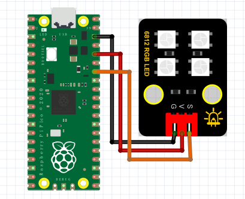

# Python

### 1. MicroPython 编程软件介绍

**MicroPython** 是一种轻量级的 Python 实现，专为微控制器和嵌入式系统设计。它可以将 Python 的强大功能应用到微控制器，用户能够以简单易懂的方式控制硬件。

MicroPython 支持多种硬件平台，包括树莓派Pico、ESP8266和ESP32，为用户提供了编写小型、功能强大的代码的能力，特别适合教育和项目开发。

---

### 2. 连接图

**连接图：**



### 3. 导入库

在控制SK6812 LED时，我们通常使用`neopixel`库。可以通过以下方式进行导入：

1. 确保您在MicroPython设备（如ESP8266或ESP32）上已安装了`neopixel`库。大多数情况下，MicroPython固件已经内置了该库。
2. 在代码中导入它：

```python
import machine
import neopixel
```

### 4. 简易测试代码

以下是简化的代码示例，用于控制SK6812 LED灯带（假设您已经接好了LED灯带）：

```python
import machine
import neopixel
import time

# LED数量和连接的引脚号
NUM_LEDS = 4
PIN_NUM = 28

# 初始化NeoPixel对象
np = neopixel.NeoPixel(machine.Pin(PIN_NUM), NUM_LEDS)

# 定义颜色
RED = (255, 0, 0)
GREEN = (0, 255, 0)
BLUE = (0, 0, 255)
WHITE = (255, 255, 255)
BLACK = (0, 0, 0)

while True:
    np[0] = RED    # 第一颗灯亮红色
    np.write()     # 更新LED
    time.sleep(1)

    np[1] = GREEN  # 第二颗灯亮绿色
    np.write()
    time.sleep(1)

    np[2] = BLUE   # 第三颗灯亮蓝色
    np.write()
    time.sleep(1)

    np[3] = WHITE  # 第四颗灯亮白色
    np.write()
    time.sleep(1)

    # 全部熄灭
    for i in range(NUM_LEDS):
        np[i] = BLACK
    np.write()
    time.sleep(1)
```

### 5. 测试结果

按照接线图连接并上传代码后，上电运行模块，4个 LED 将陆续显示不同的颜色：

1. **第一颗 LED** 亮红色。
2. **第二颗 LED** 亮绿色。
3. **第三颗 LED** 亮蓝色。
4. **第四颗 LED** 亮白色。

最后，所有 LED 将熄灭。这个示例通过`neopixel`库提供了一个更简单的方式来控制LED灯，适合初学者快速上手。

